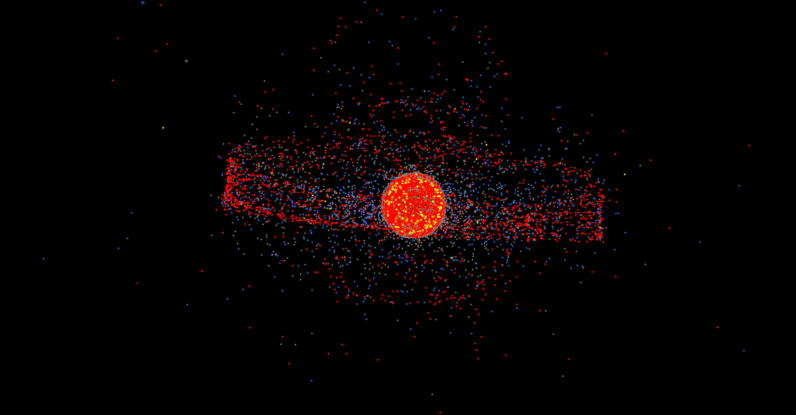

---

La __estación espacial rusa Mir__ operó en una órbita terrestre baja, con una inclinación de 51,6º respecto al ecuador y una altitud típica entre 300 y 400 km (perigeo/apogeo ~385-393 km). Completó más de 86.000 órbitas (33.454.000km) a unos 27.000 km/h, siendo destruida de forma controlada en el Océano Pacífico Sur en 2001.

- Órbita: Órbita terrestre baja (LEO), diseñada para la investigación científica y habitada continuamente.
- Velocidad: Aproximadamente 27.000 km/h.
- Inclinación: 51,6 grados respecto al ecuador
- Altitud: Inicialmente sobre los 300-400 km, ajustada a lo largo de su vida útil.
- Desorbitación: 23 de marzo de 2001, en el Pacífico Sur.

La Mir fue la primera estación espacial modular, ensamblada entre 1986 y 1996, y sirvió como base tecnológica para la Estación Espacial Internacional (EEI).