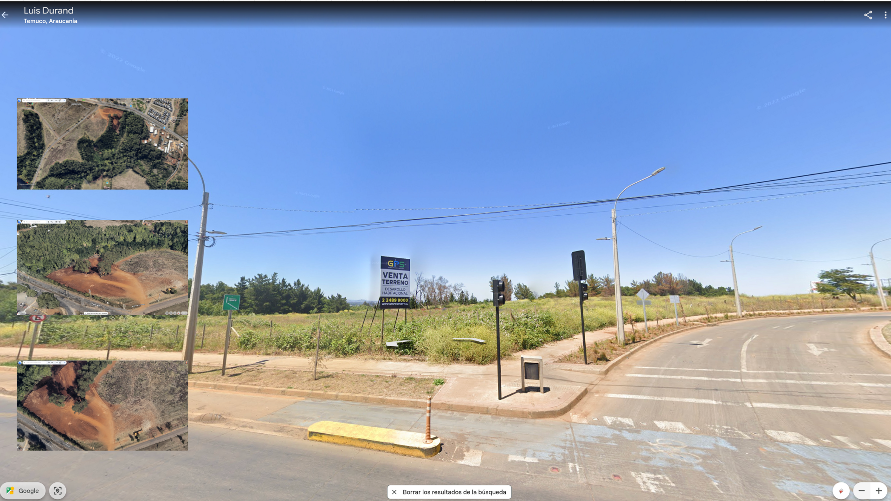

Fabricados en Taiwán y Japón, intervenidos por una compañía adquirida por el Mossad con sede en Budapest, distribuidos por una empresa búlgara, comprados por miembros de Hezbollah en El Líbano y Siria;  37 muertxs, 2 niñxs; 3.000 personas heridas en centros comerciales y hospitales. El cambio tecnológico que implementaba la organización, con llamamientos a enterrar bajo tierra, en cajas metálicas, todos los teléfonos celulares, tenía como objetivo establecer un sistema de comunicación unidireccional que impidiera la triangulación y geolocalización. Salir del registro en apariencia permanente, bidireccional, de nuestros teléfonos con la red de antenas de radiofrecuencias existentes por todo el planeta. Los buscapersonas emitieron el pitido de un falso mensaje; luego, se callaban. Antes de explotar. 

Causar lesiones con explosivos es una cuestión de proximidad. 

Me voy a comer el mundo. El tuyo, el mio. 

_Comer como antropofagia_

__Tropicalismo__: _O tropicalismo não pretendia ser porta-voz da revolução social, mas revolucionar a linguagem e o comportamento na vida cotidiana, incorporar-se à sociedade de massa e aos mecanismos do mercado de produção cultural, sem deixar de criticar a ditadura. Articulava aspectos modernos e arcaicos, buscando retomar criativamente a tradição cultural brasileira e incorporar de forma antropofágica influências do exterior (2007:189)_.

---

<small>__imagen cabecera__ [_chimeric mouse pup_, Alan Handyside](https://wellcomecollection.org/works/rd4rmzke/images?id=t9y3x5rp). CC0 1.0 Universal.</small>

