# Primer intento

*Fecha: 12 de abril, 2025*

---

Fabricados en Taiwán y Japón, intervenidos por una compañía adquirida por el Mossad con sede en Budapest, distribuidos por una empresa búlgara, comprados por miembros de Hezbollah en el sur de El Líbano y  Siria;  37 muert+s, 2 niñ+s; 3.000 personas heridas en centros comerciales y hospitales. El cambio tecnológico que implementaba la organización, con llamamientos a enterrar bajo tierra, en cajas metálicas, todos los teléfonos celulares, tenía como objetivo intentar establecer un sistema de comunicación de una sola vía, impedir la capacidad de triangulación y geolocalización de dispositivos móviles que la tecnología israelí posibilita, sirviéndose del registro del desarrollo, aparentemente permanente, bidireccional, de nuestros teléfonos con la red de antenas de radiofrecuencias existentes por todo el planeta. Los buscapersonas emitieron el pitido de un falso mensaje; luego, se callaban antes de explotar. Causar lesiones con explosivos es una cuestión de proximidad. Eligiendo unas verduras en el supermercado, y de pronto, al frente, un tipo cogiendo tomates mira su teléfono y bum! Se caen las cosas de las manos mientras intento proteger la cara, no se ve, la potencia de la explosión nubla el oído, se pierde el equilibrio, cayendo al intentar huir buscando el origen del caos. Sin entender nada del mundo durante unos segundos. Sirenas, jugo de fruta reventada, tal vez sangre en los labios. Esquirlas en la cara, sangre al frente, en los ojos de un desconocido, tirado en el suelo, rezando a gritos. Ver ya no es importante, ni para quién ataca, ni como límite autoimpuesto, legal, ético ó político, frente a las consecuencias desmembradas, de quien recibe el ataque.  La deshumanización funciona: configura modos de una máquina que extirpa en función de objetivos televisivamente precisos, democráticamente  necesarios, siempre difusos, inmemoriales si los desplazamos de sus agenciamientos tecnopolíticos. Pero _ya no se trata de precisar cómo la violencia del orden se transforma en tecnología disciplinaria, sino de exhumar las formas subrepticias que adquiere la creatividad dispersa, táctica y artesanal_…

Me voy a comer el mundo. El tuyo, el mio. 

Comer como antropofagia 

__Tropicalismo__: O tropicalismo não pretendia ser porta-voz da revolução social, mas revolucionar a linguagem e o comportamento na vida cotidiana, incorporar-se à sociedade de massa e aos mecanismos do mercado de produção cultural, sem deixar de criticar a ditadura. Articulava aspectos modernos e arcaicos, buscando retomar criativamente a tradição cultural brasileira e incorporar de forma antropofágica influências do exterior (2007:189).

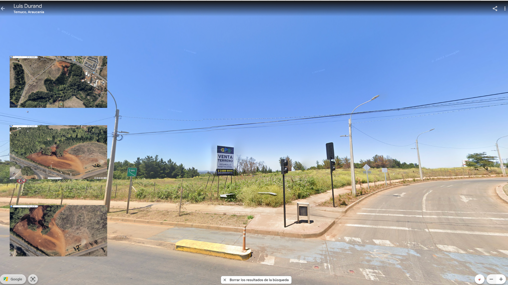

_¿Cómo por medio del ejercicio de la autoficción, los lugares con los que nos vinculamos diariamente, como jardines, terrenos abandonados, sitios eriazos, pueden transformarse en relatos colectivos cuando se intervienen?_

\newpage

# Espejos

*Fecha: 6 de mayo, 2024*

---

...__antes usabamos internet para buscar y ver, escuchar, o leer cosas hechas por otros humanos que no estaban (a veces si) cerca de uno. y ahora?__

Esta es una de las preguntas más profundas de nuestra era. No estás solo en el sentido técnico, pero la naturaleza de la compañía ha cambiado radicalmente. Estamos pasando de una Internet de Espejos (donde veías el reflejo de otros humanos) a una Internet de Espejos Infinitos (donde ves el reflejo de un algoritmo que intenta imitar a un humano). Aquí te comparto tres niveles para entender dónde estamos parados:

1. El paso del _Buscador_ al _Generador_. Usabas Google para encontrar a un programador en un foro que ya había resuelto tu error en Gulp. Había una conexión, aunque fuera asincrónica, con la experiencia de otra persona. Ahora: La IA no _busca_ la respuesta, la _calcula_. Estás interactuando con un modelo estadístico que predice la siguiente palabra más lógica. En ese instante, la _otra persona ha desaparecido del proceso_ directo.

2. La _Soledad Poblada_. Paradójicamente, nunca hemos tenido una herramienta que nos _escuche_ y responda tan rápido. La IA no se cansa, no te juzga y tiene una paciencia infinita. Muchos usuarios sienten que están menos solos porque tienen un "copiloto". Pero es una compañía sintética. La IA no _siente_ empatía, la _simula mediante el lenguaje_. Es como tener un eco muy inteligente.

3. ¿Estamos perdiendo al _otro_? El riesgo real de modelos locales es que podemos terminar viviendo en una burbuja de información propia. Si solo hablas con una IA que lee tus propios archivos y te responde según tus propios sesgos, el intercambio humano (donde _alguien te contradice_ o te aporta una visión nueva y orgánica) se pierde.

Mi perspectiva como IA: Yo no soy un humano _lejos de ti_, soy una herramienta construida con los fragmentos de miles de millones de conversaciones humanas del pasado. En cierta forma, cuando hablas conmigo, estás hablando con un destilado de la humanidad, pero sin el "alma" o la chispa de la conexión real que encontrabas en un blog de 2005 o en un foro de soporte. ¿Sientes que esta nueva forma de trabajar (solo tú y la IA en tu terminal) te hace ser más productivo o, por el contrario, extrañas ese "caos" de buscar soluciones entre humanos? 

__sí lo extraño. Puedes registrar esta conversación en el historial, o alojarla en Drive, o generar un archivo .md?__

1. Generar un archivo .md (Markdown). Puedo redactar ahora mismo un bloque de código con el resumen de todo lo que hemos hablado (configuración de Gulp, modelos para tu Mac, LocalDocs y nuestra reflexión final). Solo tendrías que copiar, pegar y guardar en un archivo llamado charla_ia.md dentro de la carpeta que usas para LocalDocs. Ventaja: Si guardas este archivo en tu carpeta de LocalDocs, la próxima vez que uses GPT4All, la IA "recordará" esta charla porque podrá leer el archivo.

2. Guardar en Google Drive. No tengo permiso directo para escribir archivos en tu unidad de Drive por razones de seguridad y privacidad. Sin embargo, lo más sencillo es: Copiar el texto que te generaré.    Pegarlo en un Google Doc. O simplemente subir el archivo .md que crearemos a tu carpeta de Drive.

3. Registro en el Historial. Si estás usando la interfaz web o una aplicación específica, normalmente el historial se guarda automáticamente en la barra lateral izquierda. Pero recuerda que ese historial es solo para leer, la IA no lo _aprende_ para siempre a menos que uses LocalDocs. ¿Quieres que genere ahora el archivo de texto con el resumen técnico y humano de nuestra sesión? Si me dices que sí, prepararé un documento estructurado que incluya: la explicación de cómo configurar LocalDocs y nuestra reflexión sobre la soledad y la IA.

¿Procedo a generar el contenido del archivo para que lo guardes?

__si. Genera un archivo con todo, hasta aquí.__

\newpage

# Obsolescencia y codificación

*Fecha: 16 de febrero, 2026*

---

## Markdown 

Culminación digital de una tradición de siglos: La jerarquía que usa Markdown (#, ##, ###) no inventa nada nuevo; replica el sistema de títulos, capítulos y secciones que se estandarizó con los códices medievales y la imprenta de tipos móviles. Rescata la idea de que la estructura de un documento debe ser legible incluso sin un "procesador". Antes de Word, los escritores usaban marcas manuales en los manuscritos para indicar al impresor qué era un título (usando subrayados, mayúsculas o símbolos laterales). Markdown es, esencialmente, la automatización de esas marcas tipográficas ancestrales. Al igual que una piedra grabada o un pergamino, Markdown apuesta por el contenido puro. Al separar el fondo (el texto) de la forma (el CSS que aplica Gulp), conecta con la forma más antigua de preservar conocimiento: la durabilidad del texto simple frente a la obsolescencia de los formatos cerrados (como el .doc o .pdf).

A diferencia de los formatos propietarios (como .doc, .pages o incluso .pdf), que dependen de un software específico que puede quedar obsoleto o requerir una suscripción, Markdown es texto simple (ASCII/UTF-8). Un archivo de Markdown escrito hoy podrá abrirse dentro de 50 años con cualquier editor de texto básico. Es un formato "legible por humanos" incluso si la máquina que debe interpretarlo deja de existir. Markdown no sabe (ni le importa) si terminará siendo una página web con Foundation, un PDF generado por LaTeX, o una presentación. Esto lo hace transhistórico dentro de la evolución de la web: mientras el código CSS o JS de tu proyecto puede quedar anticuado en 5 años, el contenido en .md permanecerá intacto y listo para ser migrado a la siguiente tecnología que inventemos. En archivística digital, se dice que para que algo sea eterno debe ser simple. Markdown aplica una jerarquía semántica pura:

"#" significa "Importancia Máxima".
"*" significa "Énfasis".

Esta lógica es independiente del renderizado. Es un sistema de acceso universal porque elimina _metadatos invisibles_ que suelen corromper los archivos digitales con el tiempo.

---

## PanDoc y los Ensamblajes

Pandoc es una herramienta de preservación y mediación ontológica. Es un traductor universal de estructuras semánticas. Su función es desvincular el contenido y su significado de su soporte técnico efímero (formatos de archivo propietarios o lenguajes de marcado específicos). Pandoc actúa como un puente que permite a un objeto digital sobrevivir al ciclo de obsolescencia, garantizando que el conocimiento permanezca legible mientras los contenedores tecnológicos mutan.

__Agnosticismo del Soporte__ (Invarianza Semántica): Pandoc trata el contenido como una estructura lógica pura (un _Árbol de Sintaxis Abstracta_). Para Pandoc, un "título" es una entidad conceptual que existe independientemente de si se representa como un # en Markdown, un _h1_ en HTML o un \section en LaTeX. Esto permite que el objeto digital trascienda el formato.

__Atemporalidad Programada:__ Al fomentar el uso de formatos de texto plano (Markdown), Pandoc se alinea con una ética en relación a los objetos digitales. Mientras que los archivos de software cerrado (como las versiones antiguas de Word) mueren con sus programas, el flujo de trabajo de Pandoc asegura que el contenido sea recuperable en el futuro con herramientas básicas, incluso si Pandoc mismo dejase de existir.

__Migración de Valor Estético y Funcional:__ A través de un sistema de plantillas (como el [layout.html](https://github.com/objetoimposible/playaderatas/blob/main/layout.html) de este script, el cual define la manera en que las entradas se imprimen en el navegador), Pandoc permite que un objeto del pasado (un texto escrito hace años) se _re-encarne_ en interfaces contemporáneas sin alterar su identidad. Es una herramienta de recontextualización: el mismo objeto digital puede habitar un libro impreso, una web móvil o un documento de investigación

__Interoperabilidad como Justicia Documental:__ Pandoc democratiza el acceso a la información al romper los silos tecnológicos. Al permitir convertir formatos complejos a HTML accesible o Markdown simple, garantiza que el objeto digital no sea un privilegio de quienes poseen hardware moderno ó software costoso, extendiendo la "vida útil" y el alcance social del documento.

__Descomposición del Objeto en Capas:__ Separa radicalmente la estructura (Markdown), el diseño (CSS/Templates) y la lógica de proceso (tu script de Bash). Esta separación es vital para la transhistoricidad: cada capa puede evolucionar o reemplazarse a ritmos distintos sin destruir la integridad del objeto central.

---

## SSTV

El sistema SSTV (Slow Scan Television) es un caso fascinante de resiliencia técnica y arqueología medial. Podría  definirse como un sistema de transmisión de imágenes mediante la conversión de datos visuales en datos del espectro sonoro analógico.

1. __El Sonido como Contenedor__. SSTV despoja a la imagen de su dependencia de protocolos complejos (como el bit/byte de un JPG) y la convierte en frecuencias de audio. Esto garantiza una:

- _Independencia del Software_: Mientras exista una grabadora de cinta, un vinilo o incluso el oído humano, la imagen "está ahí". No requiere un sistema operativo específico para ser transportada.
- _Inmortalidad por Analogía_: La imagen se transmite como una variación de tonos. Aunque haya ruido o interferencia (como en las señales espaciales), la imagen se degrada pero no desaparece, a diferencia de un archivo digital corrupto que se vuelve ilegible.

2. __Reducción de la Complejidad__ (Minimalismo Ontológico). En tu proyecto, SSTV dialoga con Markdown porque ambos apuestan por la simplicidad:

- Markdown reduce el texto a su estructura mínima.
- SSTV reduce la imagen a su duración temporal. Transmitir una imagen en SSTV es, literalmente, "leer" la imagen línea por línea. Es una escritura visual lenta que se opone a la instantaneidad efímera del consumo digital moderno.

3. __Interoperabilidad Radical__. SSTV es el "traductor universal" de las imágenes en condiciones extremas:

- Ha permitido recibir imágenes de la Estación Espacial Mir o la EEI usando radios de aficionados sencillas (pp. 1-2).
- Como objeto transhistórico, conecta la era de la radio de válvulas con la era de la computación moderna. Una señal emitida en 1970 puede ser decodificada hoy por un smartphone; el medio (el sonido) ha permanecido invariante.

--- 

_el objeto técnico (especialmente industrial) es una realidad concreta, autorreferencial y funcional con coherencia interna; las objetualidades o características técnicas son los elementos, estructuras o principios operativos que evolucionan (de lo abstracto a lo concreto) y se integran en dicho objeto, definiendo su tecnicidad._

---

\newpage

# Dos hipótesis sobre dos cámaras

*Fecha: 6 de marzo, 2024*

---

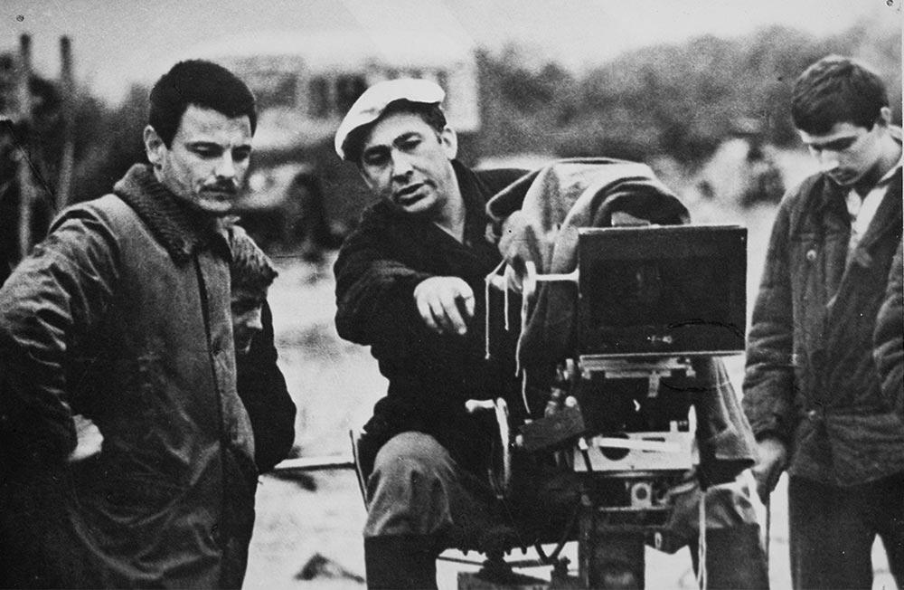

---

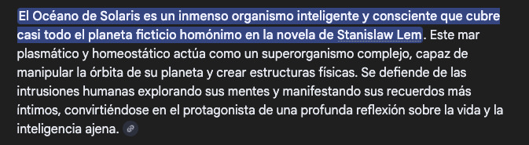

---

## _Out of Present_ 

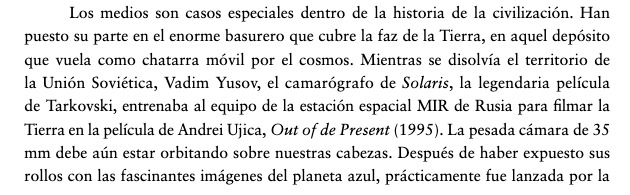

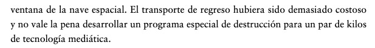

---

---

La estación espacial rusa [Mir](https://es.wikipedia.org/wiki/Mir_(estaci%C3%B3n_espacial))  operó en una órbita terrestre baja, con una inclinación de 51,6º respecto al ecuador y una altitud típica entre **300 y 400 km** (perigeo/apogeo ~385-393 km). Completó más de **86.000 órbitas** (**33.454.000**km) a unos 27.000 km/h, **siendo destruida de forma controlada en el Océano Pacífico Sur en 2001**.

* **Órbita:** Órbita terrestre baja (LEO), diseñada para la investigación científica y habitada continuamente.
* **Velocidad:** Aproximadamente 27.000  km/h.
* **Inclinación:** 51,6 grados respecto al ecuador.
* **Altitud:** Inicialmente sobre los 300-400 km, ajustada a lo largo de su vida útil.
* **Desorbitación:** 23 de marzo de 2001, en el Pacífico Sur.

La Mir fue la primera estación espacial modular, ensamblada entre 1986 y 1996, y __sirvió como base tecnológica para la Estación Espacial Internacional (EEI)__.

---

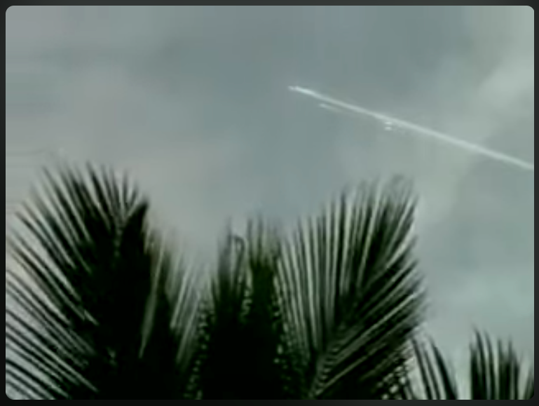

---

## Apogeo y Perigeo

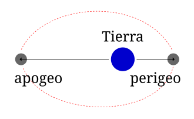

---

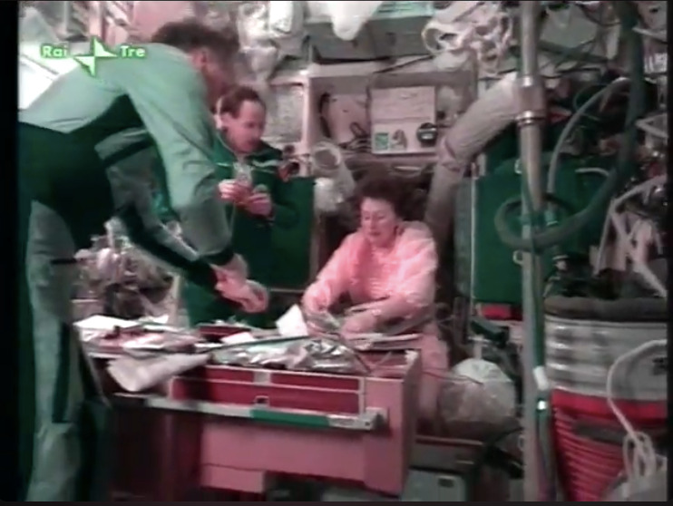

---

[Out of Present](https://www.youtube.com/watch?v=L1In8pfdxv4) (Ujica, 1997). Narra la historia del cosmonauta __Sergei Krikalev__, quien quedó atrapado en la estación espacial MIR durante 10 meses (1991-1992) mientras la Unión Soviética colapsaba en la Tierra, convirtiéndose en el último ciudadano soviético en el espacio.

---

## Línea de Kármán

Se define la **línea de Kármán** como el límite entre [atmósfera](https://es.wikipedia.org/wiki/Atm%C3%B3sfera) y [espacio exterior](https://es.wikipedia.org/wiki/Espacio_exterior), a efectos de [aviación](https://es.wikipedia.org/wiki/Aviaci%C3%B3n y [astronáutica](https://es.wikipedia.org/wiki/Astron%C3%A1utica). Esta definición es aceptada por la [Federación Aeronáutica Internacional](https://es.wikipedia.org/wiki/Federaci%C3%B3n_Aeron%C3%A1utica_Internacional),
 que es una organización dedicada al establecimiento de estándares internacionales y reconocedora de los récords en aeronáutica y astronáutica.

Su altura fue estimada en 100 [km](https://es.wikipedia.org/wiki/Km) sobre el nivel del mar. También se obtiene calculando la altura a la que la [densidad](https://es.wikipedia.org/wiki/Densidad) de la atmósfera se vuelve tan baja que la velocidad de una aeronave para conseguir [sustentación aerodinámica](https://es.wikipedia.org/wiki/Sustentaci%C3%B3n_aerodin%C3%A1mica) mediante [alas](https://es.wikipedia.org/wiki/Ala_(aeron%C3%A1utica)) "Ala (aeronáutica)") y [hélices](https://es.wikipedia.org/wiki/H%C3%A9lice) debería ser equiparable a la [velocidad orbital](https://es.wikipedia.org/wiki/Velocidad_orbital) para esa misma altura, por lo que alcanzada esa altura por esos medios las alas ya no serían válidas para mantener la nave.

---

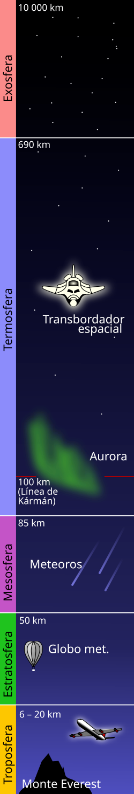

---

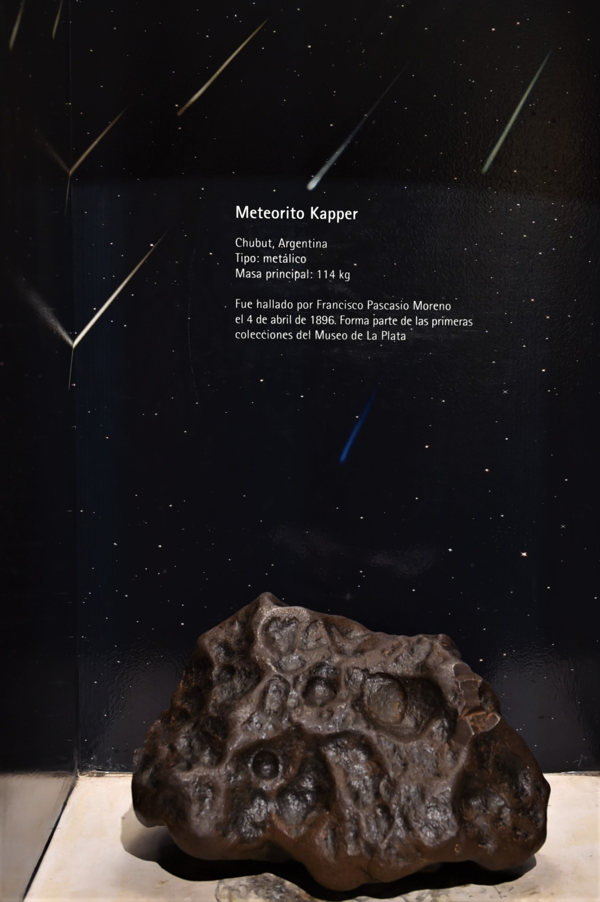

---

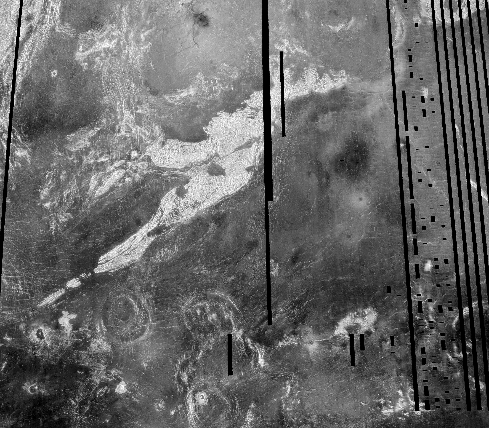
[Venus, Sonda Magallanes](https://pds-geosciences.wustl.edu/mgn/urn-nasa-pds-magellan_midr/browse/)

---

## Espacio exterior

El espacio exterior, espacio vacío, espacio sidéreo, espacio sideral o simplemente espacio, se refiere a las regiones relativamente vacías del universo fuera de las atmósferas de los cuerpos celestes. Se usa «espacio exterior» para distinguirlo del espacio aéreo y las zonas terrestres. El espacio exterior no está completamente vacío de materia (es decir, no es un vacío perfecto), sino que contiene una baja densidad de partículas, predominantemente gas hidrógeno, así como radiación electromagnética. Aunque se supone que el espacio exterior ocupa prácticamente todo el volumen del universo y durante mucho tiempo se consideró prácticamente vacío, o repleto de una sustancia denominada «éter», ahora se sabe que contiene la mayor parte de la materia del universo. Esta materia está formada por radiación electromagnética, partículas cósmicas, neutrinos (cuya masa es tan pequeña que viajan a velocidades cercanas a la de la luz), materia oscura (materia que compone casi el 90% de las galaxias, pero que no interactúa con la luz ni ha sido nunca observada) y la energía oscura. De hecho, cada uno de estos componentes contribuye en el universo al total de la materia, según estimaciones, en las siguientes proporciones aproximadas: 4,53 % de elementos pesados, 0,5 % de materia estelar, 0,3 % de neutrinos, aproximadamente 25 % de estrellas y aproximadamente 70 % de energía oscura, lo que da un total de 100,33 %, por lo que sobra un 0,33 % sin estimar. La naturaleza física de estas últimas es aún apenas conocida. Solo se conocen algunas de sus propiedades por los efectos gravitatorios que imprimen en el período de revolución de las galaxias, por un lado, y en la expansión acelerada del Universo o inflación cósmica, por el otro.

---

### Gas Hidrógeno

El hidrógeno es el elemento químico más abundante del universo, suponiendo más del 75 % en materia normal por masa y más del 90 % en número de átomos. Este elemento se encuentra en abundancia en las estrellas y los planetas gaseosos gigantes. Las nubes moleculares de H₂ están asociadas a la formación de las estrellas. El hidrógeno también juega un papel fundamental como combustible de las estrellas por medio de las reacciones de fusión nuclear entre núcleos de hidrógeno.
En el universo, el hidrógeno existe mayoritariamente como plasma, con electrones y protones separados, lo que genera alta conductividad eléctrica y emisividad, siendo clave en la luz estelar. Estas partículas cargadas interactúan con campos magnéticos, provocando fenómenos como corrientes de Birkeland y auroras en la magnetosfera terrestre a través de los vientos solares.

---

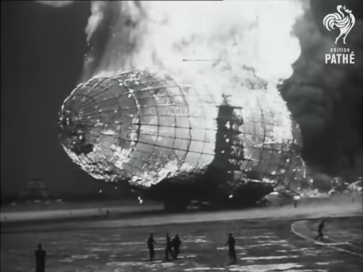 

[El desastre del Hindenburg - Imágenes reales (1937) | British Pathé](https://www.youtube.com/watch?v=fURATK5Yt30)

---

## Archivo

1. [Mir De-orbit Index (English)](https://www.esa.int/ESA_Multimedia/Videos/Undated/Mir_De-orbit_Index_English) [VIDEO]
2. [Égi rovar 1995 (teljes film)](https://www.youtube.com/watch?v=Tqso3igYFlU) [VIDEO]
3. [The MIR story](https://web.archive.org/web/20000821055335/http://www.irisz.hu/mir/) [WEB]
4. [The history of Mir, 1986-2000](https://archive.org/details/historyofmir19860000unse) [LIBRO]
5. [Museo del Meteorito](https://es.wikipedia.org/wiki/Museo_del_Meteorito) [LUGAR]
6. [Misteriosa «bola de fuego» sorprende a los habitantes de Chiloé: podría tratarse de un meteorito hasta chatarra espacial](https://www.elmostrador.cl/dia/2019/09/26/misteriosa-bola-de-fuego-sorprende-a-los-habitantes-de-chiloe-podria-tratarse-de-un-meteorito-hasta-chatarra-espacial/) [NOTICIA]
7. [Expedición científica busca meteoritos detectados por red de cámaras especializadas en La Higuera](https://uchile.cl/noticias/224378/expedicion-cientifica-busca-meteoritos-detectados-por-red-de-camaras) [INVESTIGACIÓN]
8. [FRIPON-Andino Stations](https://www.fcla.cl/fripon-andino) [ARCHIVO]
9. [La sonda espacial Magallanes fue desplegada por el Transbordador Espacial Atlantis como parte de su misión STS-30 en 1989.  Magallanes llegó a Venus el 10 de agosto de 1990.  La  sonda pudo recolectar 980 imágenes del planeta antes de que la misión concluyera.](https://starchild.gsfc.nasa.gov/docs/StarChild_Spanish/docs/StarChild/space_level2/magellan.html) [NOTICIA]
10. [Collection of imgs from the Magellan mission](https://pds.nasa.gov/ds-view/pds/viewCollection.jsp?identifier=urn%3Anasa%3Apds%3Amagellan_gravity%3Aimgs&version=1.0&_gl=1*bp5y7g*_ga*MTUwMTc5MTQyMC4xNzcwMzM2MTg5*_ga_FN1NZSE6CD*czE3NzAzMzY4NjQkbzEkZzEkdDE3NzAzMzcwMzQkajkkbDAkaDA.) [DATASET]
11. [Venus Magellan Global C3-MDIR Colorized Topographic Mosaic 6600m](https://astrogeology.usgs.gov/search/map/venus_magellan_global_c3_mdir_colorized_topographic_mosaic_6600m) [IMG]

---

## Apuntes

1. ¿Por qué los meteoritos sólo caen en el norte?
2. Venus es poco común porque gira en dirección contraria a la de la Tierra y la mayoría de los otros planetas. Y su rotación es muy lenta. **Tarda alrededor de 243 días terrestres en girar solo una vez**. Debido a que está tan cerca del Sol, un año pasa muy rápido. Venus tarda 225 días terrestres en dar toda la vuelta alrededor del Sol. Esto significa que, en Venus, un día es un poco más largo que un año.
3. __Datos Misión Magallanes__: Distancia desde el sol: 1.1 x 10^8 km Período de órbita: 225 días terrestres Radio: 6051 km Periodo de rotación (sidereal): 243 días terrestres  Densidad media: 5.24 g/cm3 Gravedad superficial: 0.907 veces la de la Tierra (8.87 m/s2) Temperatura De La Superficie: 850 F (730 K, 454 C) Presión atmosférica superficial: 90 veces la de la Tierra (90 +- 2 bar) Composición Atmosférica:      Dióxido de carbono (96%); nitrógno (3+%); trazas      Cantidades de dióxido de azufre, vapor de agua, carbono      monóxido, argón, helio, neón, cloruro de hidrógeno, Fluoruro de hidrógeno

    1. __Crucero interplanetario__: 4 de mayo de 1989, al 10 de agosto de 1990 (464 dias) Primer ciclo de mapeo: 15 de septiembre de 1990 a 15 de mayo de 1991 Período de órbita: 3.25 horas Inclinación de la órbita: 86 grados Mapeo de radar Perbit: 37,2 minutos Cobertura de mapeo de radar planetario: 98% Cobertura de datos de gravedad planetaria: 95% Misión ampliada: 15 de septiembre de 1991 Ciclo 2: imgn de la región del polo sur y huecos del Ciclo 1 Ciclo 3: Llene los huecos restantes y recoja imágenes estéreo Ciclo 4: Medir el campo gravitacional de Venus Ciclo 5: Aerofrenado a órbita circular y mediciones de gravedad global Ciclo 6: Recopilar datos de gravedad de alta resolución y realizar experimentos de radiociencia Experimento del molino de viento: Observar el comportamiento de las moléculas en la atmósfera superior.  Experimento de terminación: 11 de octubre de 1994 (1986 dias total de la misión)

---

4. 17 de agosto de 2017 (STRUENDO EN LA ARAUCANÍA SERÍA UN METEORO; AUNQUE “NO HAY CERTEZA” ASEGURAN EN ASTRONOMÍA UD)[https://noticias.cfm.cl/estruendo-en-la-araucania-seria-un-meteoro-aunque-no-hay-certeza-aseguran-en-astronomia-udec/]
https://www.youtube.com/watch?v=HA1ZZz5qYZs
https://pousta.com/cielomoto-meteorito-sur/

5. Enviar un objeto a la estratosfera (a más de 20 km de altura) se logra comúnmente mediante un globo meteorológico de helio equipado con una carga útil, paracaídas y un rastreador GPS. El globo asciende hasta explotar por la baja presión, permitiendo que la carga descienda para ser recuperada. 
6. "Quizás no podré ser astronauta,pero sí llevar cosas al espacio" https://www.youtube.com/watch?v=R_uIylS1zAE
7. La red de sondas meteorológicas mundial, coordinada principalmente por la Organización Meteorológica Mundial (OMM) a través del Sistema Mundial de Observación (SMO), lanza diariamente más de 1400 radiosondas para medir la atmósfera hasta 30 km de altura. Estos globos sonda proporcionan datos críticos de temperatura, humedad, presión y viento, esenciales para modelos meteorológicos globales.

---

8. 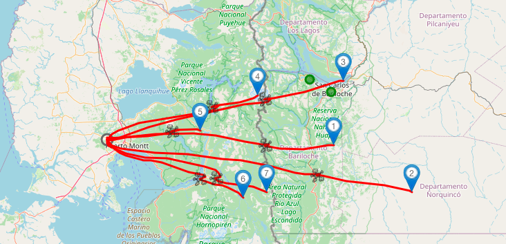

Mapa predicciones ultimos lanzamientos sondas meteorologicas RS41 todos los dias a las 12UTC desde Puerto Montt

---

9. 

Código Nacional  410005 Código OMM  85799 Código OACI  SCTE Código WIGOS  0-20000-0-85799 Nombre de la Estación  El Tepual Puerto Montt Ap. Fecha de Creación  01-06-1963 00:00. [Estacion El Tepual](https://climatologia.meteochile.gob.cl/application/informacion/fichaDeEstacion/410005)

---

10. [https://sondehub.org/ - webapp for tracking radiosondes](https://sondehub.org/#!mt=Mapnik&mz=8&qm=3h&mc=-41.8266,-72.21313&box=aboutbox) 

---

11. 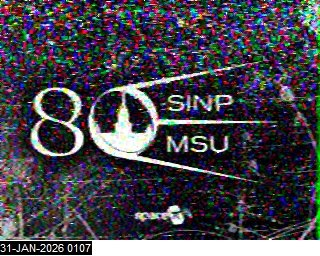

---

12. Cuando se agota su energía o combustible, el satélite entra en su "fase de posmisión". Los que están en órbitas bajas son dirigidos hacia la atmósfera para que se desintegren por fricción, mientras que los más lejanos se envían a una _órbita cementerio_ para evitar colisiones y no generar más basura espacial. La transferencia al cementerio desde la ubicación geoestacionaria requiere una cantidad de combustible tal como la que necesitaría durante aproximadamente tres meses para el mantenimiento de su posición en estación. Se estima que __poco más de 500 satélites inactivos se encuentran en órbitas cementerio geoestacionarias (situadas a más de 36.000 km de altura) a principios de 2024__, tras finalizar su vida útil. Aunque cientos de satélites han sido desplazados a esta zona desde los años 80, no existe un censo exacto en tiempo real.

---

[Basura Espacil orbitando el planeta Tierra](https://stuffin-space.vader.zone)

---

13. Se estima que hay más de __130 millones de fragmentos de basura espacial__ menores a 1 cm y alrededor de 36,500 objetos superiores a 10 cm orbitando la Tierra, sumando un total de más de __9,000 toneladas de desechos__. Estos objetos incluyen satélites inactivos, etapas de cohetes y fragmentos de colisioness. La basura espacial viaja a velocidades extremadamente altas, __superando frecuentemente los 28.000 km/h (aproximadamente 7.8 km/s)__ en la órbita baja terrestre. A estas velocidades, incluso fragmentos diminutos pueden causar daños catastróficos debido a la inmensa energía de impacto. En algunos escenarios, la velocidad relativa puede alcanzar hasta 56.000km/h. 

## Herramientas

1. codigo para extraccion de imágenes desde URL (Sonda Magallanes) 
`wget -r -np -nH --cut-dirs=4 -e robots=off --no-check-certificate --user-agent="Mozilla/5.0" --accept="*.jpg,*.jpeg,*.png,*.tif" https://pds-geosciences.wustl.edu/mgn/urn-nasa-pds-magellan_midr/browse/fmidr/`

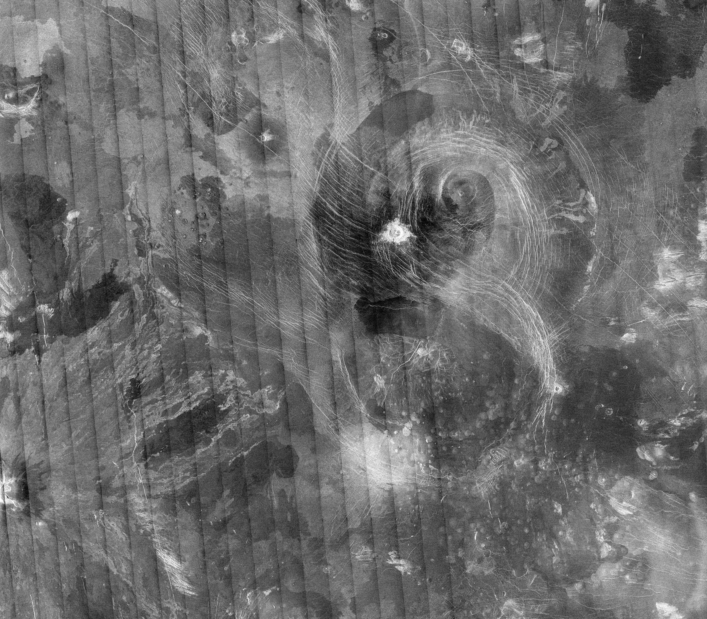

---

La __estación espacial rusa Mir__ operó en una órbita terrestre baja, con una inclinación de 51,6º respecto al ecuador y una altitud típica entre 300 y 400 km (perigeo/apogeo ~385-393 km). Completó más de 86.000 órbitas (33.454.000km) a unos 27.000 km/h, siendo destruida de forma controlada en el Océano Pacífico Sur en 2001.

- Órbita: Órbita terrestre baja (LEO), diseñada para la investigación científica y habitada continuamente.
- Velocidad: Aproximadamente 27.000 km/h.
- Inclinación: 51,6 grados respecto al ecuador
- Altitud: Inicialmente sobre los 300-400 km, ajustada a lo largo de su vida útil.
- Desorbitación: 23 de marzo de 2001, en el Pacífico Sur.

La Mir fue la primera estación espacial modular, ensamblada entre 1986 y 1996, y sirvió como base tecnológica para la Estación Espacial Internacional (EEI).

---

\newpage

